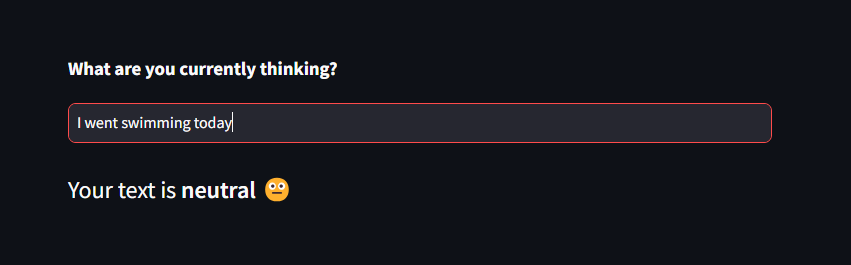

# Moduulin 3 bonustehtävä - Deployed Sentiment Analysis

Tässä tehtävässä on tehty Streamlit-sovelluskehyksen avulla yksinkertainen sovellus, joka on otettu ja julkaistu Streamlitin pilvipalvelun kautta osoitteessa: __. Sovelluksessa hyödynnetään moduulissa 2 tehtyä tunneanalyysimallia, jonka avulla käyttäjän syötteestä analysoidaan sen tunnelma. Analysoitu tunnelma tuodaan käyttöliittymään Streamlitin toimintojen avulla:



## Projektin kloonaaminen ja konfigurointi paikallisesti

```
git clone https://github.com/inkaliinalauranto/Deployed-Streamlit-Sentiment-Analysis.git  
```

```
cd Deployed-Streamlit-Sentiment-Analysis
```
```
python -m venv .venv
```
```
.venv\Scripts\activate.bat
```
```
python -m pip install -r requirements.txt
```
```
streamlit run app.py
```

